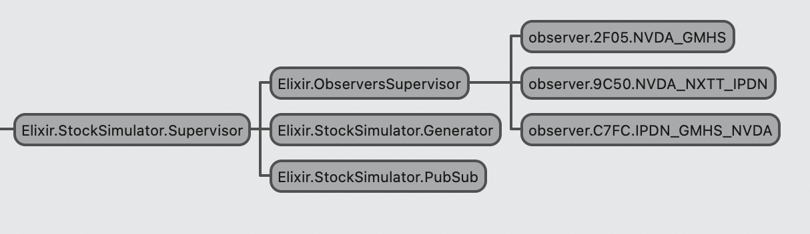

# StockSimulator

## Description

Simple Stock Exhange simulator, based on 3 components:

- Generator: Generates a random price to a stock each iteration
- Observer: Subscribe to stocks by name waiting a notification of price update and prints it to stdio
- PubSub: Collects stocks prices updates and notify subscribers to that stock 

## Architecture



`StockSimulator` is build using GenServer framework. At application start we run the `PubSub` and `Generator` services, and a `DynamicSupervisor` responsible to monitor all `Observer` created, isolating and restarting them on a failure situation.

## How to run

### Standalone Application

```
mix escript.build && ./stock_simulator
```

Will spin the application creating 3 observers for some random stocks.

At begining you will see something like

```
20:18:06.000 [info] PubSub::Subscribing {observer.2F05.NVDA_GMHS, NVDA}
20:18:06.000 [info] PubSub::Subscribing {observer.2F05.NVDA_GMHS, GMHS}
20:18:06.000 [info] PubSub::Subscribing {observer.9C50.NVDA_NXTT_IPDN, NVDA}
20:18:06.000 [info] PubSub::Subscribing {observer.9C50.NVDA_NXTT_IPDN, NXTT}
20:18:06.000 [info] PubSub::Subscribing {observer.9C50.NVDA_NXTT_IPDN, IPDN}
20:18:06.000 [info] PubSub::Subscribing {observer.C7FC.IPDN_GMHS_NVDA, IPDN}
20:18:06.000 [info] PubSub::Subscribing {observer.C7FC.IPDN_GMHS_NVDA, GMHS}
20:18:06.000 [info] PubSub::Subscribing {observer.C7FC.IPDN_GMHS_NVDA, NVDA}
```

That's the obsevers being created and subscribing to stocks updates.

After that `PubSub` will start notifying subscribers for each update on stock prices received

```
20:18:08.645 [info] PubSub::received {NVDA, $880.75}
20:18:08.645 [info] observer.C7FC.IPDN_GMHS_NVDA::received {NVDA, $880.75}
20:18:08.645 [info] observer.9C50.NVDA_NXTT_IPDN::received {NVDA, $880.75}
20:18:08.645 [info] observer.2F05.NVDA_GMHS::received {NVDA, $880.75}
20:18:09.646 [info] PubSub::received {IPDN, $483.25}
20:18:09.646 [info] observer.C7FC.IPDN_GMHS_NVDA::received {IPDN, $483.25}
20:18:09.646 [info] observer.9C50.NVDA_NXTT_IPDN::received {IPDN, $483.25}
```

### From IEx console

Running the IEX console will start the `PubSub` and `Generator` services, and you can play with the observers, starting and killing them to check the Supervisor working.

From IEx
```
$ iex -S mix

Erlang/OTP 28 [erts-16.0.2] [source] [64-bit] [smp:8:8] [ds:8:8:10] [async-threads:1] [jit] [dtrace]

Interactive Elixir (1.18.4) - press Ctrl+C to exit (type h() ENTER for help)

20:57:23.025 [info] PubSub::received {OPEN, $192.2}
20:57:24.024 [info] PubSub::received {GMHS, $289.9}
20:57:25.025 [info] PubSub::received {IPDN, $614.58}
[...]
```

Subscribing an `Observer` to `NVDA` stock:
```
iex(1)> {:ok, o1} = StockSimulator.Observer.subscribe([:NVDA])

20:57:43.510 [info] PubSub::Subscribing {observer.C45D.NVDA, NVDA}
{:ok, #PID<0.146.0>}

20:57:44.044 [info] PubSub::received {GMHS, $89.22}
20:57:47.047 [info] PubSub::received {OPEN, $26.09}
20:57:49.049 [info] PubSub::received {NVDA, $683.31}
20:57:49.049 [info] observer.C45D.NVDA::received {NVDA, $683.31}
20:57:50.050 [info] PubSub::received {OPEN, $909.34}
20:57:51.051 [info] PubSub::received {GMHS, $667.47}
20:57:55.055 [info] PubSub::received {NVDA, $887.34}
20:57:55.055 [info] observer.C45D.NVDA::received {NVDA, $887.34}
```

Simulating a failure in observer:


```
iex(2)> StockSimulator.Observer.simulate_kill(o1)
:ok

20:58:03.493 [error] GenServer :"observer.C45D.NVDA" terminating
** (RuntimeError) >>> Killing observer.C45D.NVDA
    (stock_simulator 0.1.0) lib/stock_simulator/observer.ex:41: StockSimulator.Observer.handle_cast/2
    (stdlib 7.0.2) gen_server.erl:2460: :gen_server.try_handle_cast/3
    (stdlib 7.0.2) gen_server.erl:2418: :gen_server.handle_msg/3
    (stdlib 7.0.2) proc_lib.erl:333: :proc_lib.init_p_do_apply/3
Last message: {:"$gen_cast", :simulate_kill}
State: [:NVDA]


20:58:03.502 [info] PubSub::Subscribing {observer.6E64.NVDA, NVDA}
20:58:04.064 [info] PubSub::received {IPDN, $23.74}
20:58:06.066 [info] PubSub::received {NVDA, $841.88}
20:58:06.066 [info] observer.6E64.NVDA::received {NVDA, $841.88}
20:58:07.067 [info] PubSub::received {NVDA, $648.74}
20:58:07.067 [info] observer.6E64.NVDA::received {NVDA, $648.74}
```

## Things to improve

- In `PubSub`, the same hook that receives the stock update is responsible to push to subscribers the notification, what easily could become a bottleneck.
In a high pressure scenario, with hundreds or thousands of notifications per second, the mailbox for `PubSub` will pile up and an eventual failure of process will cause loss of messages.
An opportunity to improve here would be to separate this behavior in 2, one to just receive the notification and save it in a kind of state or cache (ETS), and another to read this state and push the notifications.
